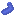

# roguelike

Gra składa się z poziomów, każdy z nich składa się z:
- losowo generowanej mapy
- losowo rozmieszczonych przeciwników

Celem gracza jest pokonanie wszystkich przeciwników na mapie za pomocą dystansowych ataków.\
Przeciwnicy zadają obrażenia graczowi również za pomocą dystansowych ataków. \

## Przeciwnicy
-  - atak długodystansowy
-  - atak krótkodystansowy

## Wzmocnienia
Po wyeliminowaniu wszystkich przeciwników gracz wybiera jedną z nagród.

-  - szybkość ataku (jak często można atakować)
-  - obrażenia ataku (jak dużo punktów życia zabiera trafiony atak)
-  - złoto (zwiększa końcowy wynik)
-  - życie
-  - szybkość poruszania

## Koniec gry
Gra nie posiada innego zakończenia niż przegrana. \
Jeżeli liczba punktów życia spadnie do 0 lub poniżej gra się kończy.

